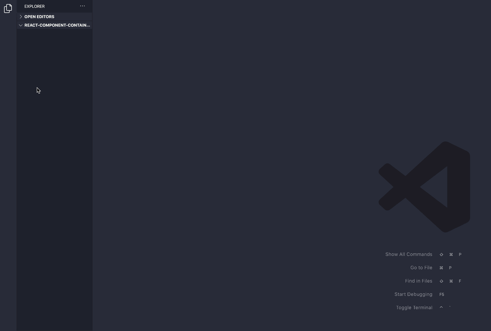

# React Component & Container Generation for VSCode

## Description

Generates React component & container files automatically.

## Usage

 

## Configuration

You can change to the extension's settings through VSCode settings. You can customize:

### `ReactComponentContainerGenerator.global.quotes`

The type of quotes

- `single`
- `double` (default)

### `ReactComponentContainerGenerator.global.semi` (default: `true`)

Whether to add a semicolon at the end of the sentence.

 

### `ReactComponentContainerGenerator.componentFile.type`

The type of generated component file

- `func` (default)
- `class`

### `ReactComponentContainerGenerator.componentFile.js`

Javascript file extension js or jsx.

- `jsx` (default)
- `js`

### `ReactComponentContainerGenerator.containerFile.folder` (default: `true`)

Whether to create a folder when creating a container

 

### `ReactComponentContainerGenerator.containerFile.name` (default: `true`)

Automatic container naming

 

### `ReactComponentContainerGenerator.styleFile.create` (default: `true`)

Whether to generate component's style file or not

 

### `ReactComponentContainerGenerator.styleFile.type`

The extension of stylesheet file to create

- `css`
- `sass`
- `scss` (default)
- `less`
- `styled-component`

## ChangeLog

### [Click here](CHANGELOG.md)

## Bugs

Please report [here](https://github.com/sh031224/react-component-container-generator/issues)
